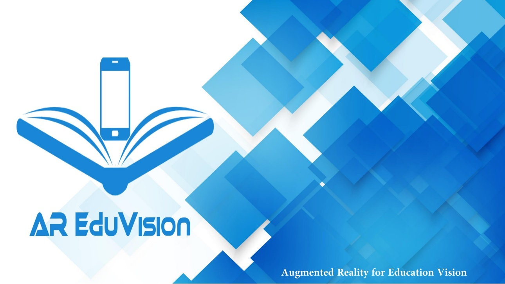

# AR-EduVision

AR EduVision is an android application that views an interactive information and 3D models by using AR environment, which helps students to understand computer hardware easily.

 

The application  has  two  parts,  one  for  scanning  and the other  for  maintenance.

##  1 - Scanning

Users scan hardware 2D pictures by their smart phone cameras from the applications' attachment book, the application identifies the 2D picture and matches it with its 3D model. Then it will show the 3D model on the screen. After that, users will have other choices either to display basic information about the model  then convert those information to speech, show the model's correct place in the computer or to make screen shot for the model and share the pictures via social media. If users do not have attachment book, AR EduVision gives them special feature that they can download all target pictures from the application to their gallery in their smart phones without needing for network connection. 

##   2 - Maintenance

Users choose the 3D model that they want to know its correct place in the computer from the menu, and then they can drag the model and drop it into its place in computer hierarchy. AR EduVision application will help them to find the correct place of the 3D model in computer hierarchy by lighting the correct place of the 3D model

# Usage:

* Download the application from here [AR EduVision.apk](https://drive.google.com/open?id=1O2f5nxkZGiyZk2eW3xiXhwIQ0JMsVToS)

* See how to use this application from here [AR Eduvision Final Project](https://youtu.be/CHoC6A2z_P4)

* For image targets of the application try to clone AR EduVision bookLast.pdf

* If you like to have a look to the documentation just clone AR EduVision full documentation 12-8-2018 last.pdf
